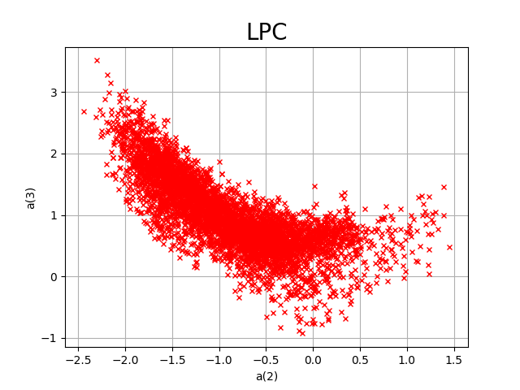
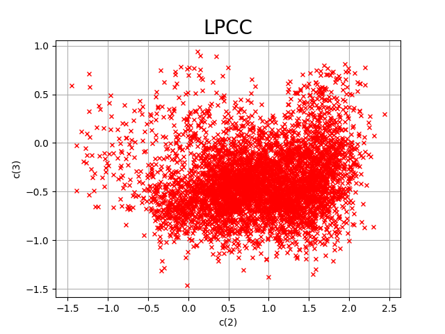
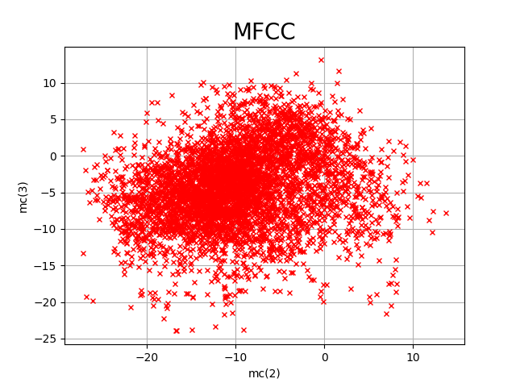
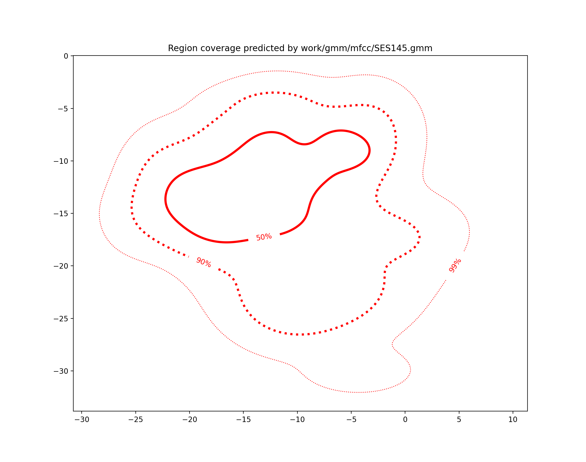
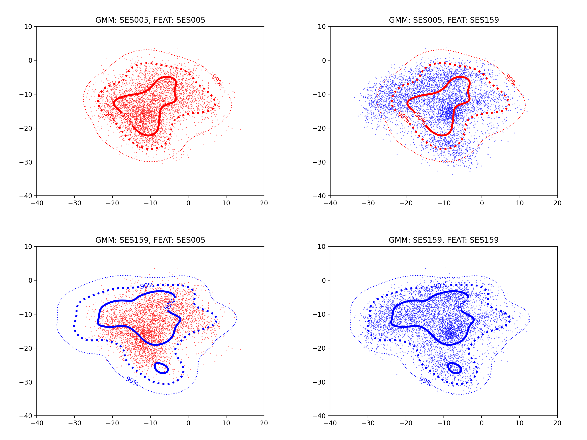

PAV - P4: reconocimiento y verificación del locutor
===================================================

**Obtenga su copia del repositorio de la práctica accediendo a [Práctica 4](https://github.com/albino-pav/P4)
y pulsando sobre el botón `Fork` situado en la esquina superior derecha. A continuación, siga las
instrucciones de la [Práctica 2](https://github.com/albino-pav/P2) para crear una rama con el apellido de
los integrantes del grupo de prácticas, dar de alta al resto de integrantes como colaboradores del proyecto
y crear la copias locales del repositorio.**

**También debe descomprimir, en el directorio `PAV/P4`, el fichero [db_8mu.tgz](https://atenea.upc.edu/pluginfile.php/3145524/mod_assign/introattachment/0/spk_8mu.tgz?forcedownload=1)
con la base de datos oral que se utilizará en la parte experimental de la práctica.**

**Como entrega deberá realizar un *pull request* con el contenido de su copia del repositorio. Recuerde
que los ficheros entregados deberán estar en condiciones de ser ejecutados con sólo ejecutar:**

~~~~~~~~~~~~~~~~~~~~~~~~~~~~~~~~~~~~~~~~~~~~~~~~~~~~~.sh
  make release
  run_spkid mfcc train test classerr verify verifyerr
~~~~~~~~~~~~~~~~~~~~~~~~~~~~~~~~~~~~~~~~~~~~~~~~~~~~~

**Recuerde que, además de los trabajos indicados en esta parte básica, también deberá realizar un proyecto
de ampliación, del cual deberá subir una memoria explicativa a Atenea y los ficheros correspondientes al
repositorio de la práctica.**

**A modo de memoria de la parte básica, complete, en este mismo documento y usando el formato *markdown*, los
ejercicios indicados.**

## Ejercicios.

### SPTK, Sox y los scripts de extracción de características.

- **Analice el script `wav2lp.sh` y explique la misión de los distintos comandos, y sus opciones, involucrados en el *pipeline* principal (`sox`, `$X2X`, `$FRAME`, `$WINDOW` y `$LPC`).**
    
    - `sox`: Lo utilizamos para convertir un señal de audio en un formato concreto (WAVE en nuestro caso) a (`-t`) un señal sin cabeceras (*raw*), codificado como (`-e`) signed de 16 bits (`-b`). Tiene una infinidad de  opciones, entre ellas: mezclar múltiples ficheros de entrada, normalizar, ajuste de volumen, definir tipo de archivo de salida, número de canales, etc.
    
    - `$X2X`: Programa de SPTK que nos permite convertir datos de una entrada estándard a otro tipo de datos (`+sf`, short format en nuestro caso), enviando el resultado a una salida estándard. Los tipos de datos de entrada y salida se pueden especificar en la línea de comandos.
    
    - `$FRAME`: Convierte una secuencia de datos de entrada en un conjunto de frames, que pueden estar o no superpuestos, con un periodo (`-p`) P y una longitud (`-l`) L. En nuestro caso, utilizamos una longitud de 240 muestras y un periodo de 80 muestras.
    
    - `$WINDOW`: Como bien dice su nombre, sirve para enventanar una secuencia de datos. La ventana escogida (`-w`) (Blackman, Hamming, Barlett,...) se multiplica por la secuencia de datos de entrada de longitud (`-l`) l obteniendo una salida de longitud (`-L`) L. En `wav2lp.sh` se usa la ventana de Blackman por defecto y una longitud de 240 muestras tanto para los datos de entrada como los de salida.
    
    - `$LPC`: Calcula los coeficientes LPC (predicción lineal) usando el método Levinson-Durbin. Con ayuda de las opciones fijamos la longitud del frame (`-l`) a 240 muestras y el orden del LPC (`-m`).
    

- **Explique el procedimiento seguido para obtener un fichero de formato *fmatrix* a partir de los ficheros de salida de SPTK (líneas 41 a 47 del script `wav2lp.sh`).**

    Primero de todo, obtenemos el fichero $base.lp con los coeficientes LPC, encadenando los comandos descritos en el apartado anterior.
    
    Después fijamos una cabecera para el archivo de salida con el número de filas y columnas de la matriz. El número de columnas será el orden del LPC + 1, ya que en la primera columna encontraremos el factor de ganancia. El número de filas será el número total de tramas a las que se les ha calculado los coeficientes LPC. Lo extraemos del fichero .lp convirtiendo el contenido a ASCII con `X2X +fa` y contando el número de líneas con el comando `wc -l`.
    
    Finalmente utilizamos `X2X` para guardar la cabecera en el archivo y `cat` para copiar todos los coeficientes en el archivo en forma de matriz.

  * **¿Por qué es conveniente usar este formato (u otro parecido)?**
  
    De esta manera tendremos un fácil y rápido acceso a todos los datos almacenados con una correspondencia directa entre la posición en la matriz y el orden del coeficiente y número de trama, por lo que simplifica mucho su manipulación a la hora de trabajar. También nos ofrece información directa en la cabecera sobre el número de tramas y número de coeficientes calculados.

- **Escriba el *pipeline* principal usado para calcular los coeficientes cepstrales de predicción lineal (LPCC) en su fichero <code>scripts/wav2lpcc.sh</code>:**

    ```sh
    sox $inputfile -t raw -e signed -b 16 - | $X2X +sf | $FRAME -l 240 -p 80 | $WINDOW -l 240 -L 240 |
       $LPC -l 240 -m $lpc_order | $LPCC -m $lpc_order -M $cepstrum_order > $base.lpcc
    ```

- **Escriba el *pipeline* principal usado para calcular los coeficientes cepstrales en escala Mel (MFCC) en su fichero <code>scripts/wav2mfcc.sh</code>:**

    ```sh
    sox $inputfile -t raw -e signed -b 16 - | $X2X +sf | $FRAME -l 240 -p 80 | $WINDOW -l 240 -L 240 |
       $MFCC -l 240 -m $mfcc_order -n $num_filters -s $sampl_freq > $base.mfcc
    ```
    
    No fijamos los valores de los parámetros en el pipeline de <code>scripts/wav2mfcc.sh</code> ya que posteriormente buscaremos optimizarlos a través del script <code>scripts/run_spkid.sh</code>

### Extracción de características.

- **Inserte una imagen mostrando la dependencia entre los coeficientes 2 y 3 de las tres parametrizaciones para una señal de prueba.**

    Hemos representado las parametrizaciones de las señales usando como ejemplo el locutor SES005. Todas las gráficas han sido obtenidas usando la librería **matplotlib**.
    
    #### LPC
    
   
    
    Extraemos los coeficientes **a(2)** y **a(3)** de los ficheros del locutor SES005 usando la orden:
    
    `matrix_show work/lp/BLOCK00/SES005/*.lp | egrep '^\[' | cut -f3,4 > grafics/lp_2_3.txt`
    
    
    
    
    
    #### LPCC
    
   
    
    Extraemos los coeficientes **c(2)** y **c(3)** de los ficheros del locutor SES005 usando la orden:
    
    `fmatrix_show work/lpcc/BLOCK00/SES005/*.lpcc | egrep '^\[' | cut -f3,4 > grafics/lpcc_2_3.txt`
    
    
    
    
    #### MFCC
    
   
    
    Extraemos los coeficientes **mc(2)** y **mc(3)** de los ficheros del locutor SES005 usando la orden:
    
    `fmatrix_show work/mfcc/BLOCK00/SES005/*.mfcc | egrep '^\[' | cut -f3,4 > grafics/mfcc_2_3.txt`
    
    
  
  + **¿Cuál de ellas le parece que contiene más información?**
    
    Analizando gráficamente la dependencia entre los coeficientes podríamos decir que MFCC es la parametrización que nos aporta más información seguido de LPCC. Esto se debe a que si dos coeficientes estan muy correlados, conociendo uno de los dos podemos determinar el valor del otro. Una alta correlación entre los coeficientes se plasmará en nuestra gráfica en forma de recta o línea estrecha.
    
    Ahora si nos fijamos en las gráficas, vemos que LPC es la parametrización que menos información nos aporta, ya que se genera una clara recta estrecha en la gráfica. LPCC sería el intermedio, ya que hay una mayor dispersión en el plano pero también una muy alta concentración de puntos en un rango muy pequeño.
    
    Finalmente, concluimos que MFCC es la parametrización más efectiva y con más información ya que hay una mayor dispersión en la gráfica en un zona mucho más amplia que las anteriores sin formar ningún tipo de recta o línea y, por tanto, con unos coeficientes menos correlados.

- **Usando el programa <code>pearson</code>, obtenga los coeficientes de correlación normalizada entre los parámetros 2 y 3, y rellene la tabla siguiente con los valores obtenidos.**
    
    `pearson work/lp/BLOCK00/SES005/*.lp`
    `pearson work/lpcc/BLOCK00/SES005/*.lpcc`   
    `pearson work/mfcc/BLOCK00/SES005/*.mfcc`   `
    
    Usando los coeficientes mostrados en el apartado anterior, obtenemos la siguiente tabla:

  |                        | LP   | LPCC | MFCC |
  |------------------------|:----:|:----:|:----:|
  | &rho;<sub>x</sub>[2,3] |-0.7057|0.3003|0.1105|
  
  + **Compare los resultados de <code>pearson</code> con los obtenidos gráficamente.**

    Un valor de **|&rho;<sub>x</sub>[2,3]|** alto nos indica que los coeficientes están muy correlados y un valor bajo nos indica que los coeficientes están poco correlados (**|&rho;<sub>x</sub>[2,3]|** ∊ [0,1]). Por tanto, observamos que los resultados de `pearson`concuerdan con las conclusiones obtenidas al analizar las gráficas: LPC es la parametrización que nos aporta menos información con diferencia, MFCC la que más, ya que sus coeficientes están muy poco correlados, y LPCC nos aportá un poco menos de información que MFCC. Esto nos ayuda a ver que MFCC será la parametrización adecuada para optimizar nuestro sistema.
  
- **Según la teoría, ¿qué parámetros considera adecuados para el cálculo de los coeficientes LPCC y MFCC?**

    #### LPCC
    
    De 8 a 12 coeficientes de predicción (P) y (3/2)P coeficientes cepstrales (Q).
    
    #### MFCC
    
    - Se utilizan entre 14 y 18 coeficientes para reconocimiento del hablante.
    - Se suele utilizar un banco de 24 a 40 filtros paso-banda en la escala Mel, aunque también obtenemos buenos resultados con 20 filtros.
    
    Estos rangos nos servirán para optimizar nuestro sistema y encontrar los valores que nos aportan mejores resultados.
    
    En general, respecto a la longitud del frame se recomienda utilizar 20-30ms, con una superposición de 10-15ms. Utilizamos 30ms = 240 muestras de longitud y 10ms = 80 muestras de superposición de frames (Fs = 8 kHz).

### Entrenamiento y visualización de los GMM.

**Complete el código necesario para entrenar modelos GMM.**

- **Inserte una gráfica que muestre la función de densidad de probabilidad modelada por el GMM de un locutor para sus dos primeros coeficientes de MFCC.**
  
  
  
- **Inserte una gráfica que permita comparar los modelos y poblaciones de dos locutores distintos (la gŕafica de la página 20 del enunciado puede servirle de referencia del resultado deseado). Analice la capacidad del modelado GMM para diferenciar las señales de uno y otro.**
  
  
  

### Reconocimiento del locutor.

**Complete el código necesario para realizar reconociminto del locutor y optimice sus parámetros.**

- **Inserte una tabla con la tasa de error obtenida en el reconocimiento de los locutores de la base de datos SPEECON usando su mejor sistema de reconocimiento para los parámetros LP, LPCC y MFCC.**
  
 
  |                        | LP   | LPCC | MFCC |
  |------------------------|:----:|:----:|:----:|
  | Tasa de error |13.76%|4.33%|1.27%|
  

### Verificación del locutor.

**Complete el código necesario para realizar verificación del locutor y optimice sus parámetros.**

- **Inserte una tabla con el *score* obtenido con su mejor sistema de verificación del locutor en la tarea de verificación de SPEECON. La tabla debe incluir el umbral óptimo, el número de falsas alarmas y de pérdidas, y el score obtenido usando la parametrización que mejor resultado le hubiera dado en la tarea de reconocimiento.**
 
 
  |CostDetection obtenido| 37.9 | 
  |------------------------|:----:|
  | Umbral óptimo|1.563242302836|
  | Número de falsas alarmas|70 / 250 = 0.2800|
  | Número de pérdidas |1 / 1000 = 0.0010|
  
 
### Test final y trabajo de ampliación.

- **Recuerde adjuntar los ficheros `class_test.log` y `verif_test.log` correspondientes a la evaluación *ciega* final.**

- **Recuerde, también, enviar a Atenea un fichero en formato zip o tgz con la memoria con el trabajo realizado como ampliación, así como los ficheros `class_ampl.log` y/o `verif_ampl.log`, obtenidos como resultado del mismo.**
